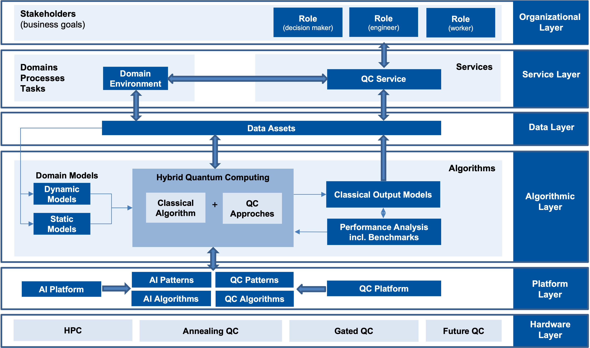
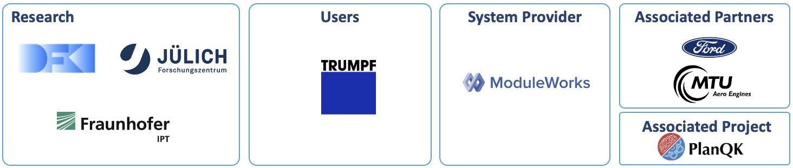

# QUASIM
Quantum Computing Enhanced Service Ecosystem for Simulation in Manufacturing.

## Protoype for QC-supported Simulations in Laser Cutting: 

*Figure 1: The demonstrator supporting the presentation of the prototype (inlcuding both blisk, and metal plates with laser cuts)*

## Target Image
 

*Figure 1: Representation of QUASIM target image.*

## Consortium

1. [German Research Center for Artificial Intelligence GmbH (DFKI) (Saarbrücken)](https://www.dfki.de/web)
2. [Jülich Research Center (FZJ) (Jülich)](https://www.fz-juelich.de),
3. [Fraunhofer Institute for Production Technology (IPT) (Aachen)](https://www.ipt.fraunhofer.de),
4. [ModuleWorks GmbH (MW) (Aachen)](https://www.moduleworks.com/),
5. [TRUMPF Machine Tools GmbH + Co. KG (Ditzingen)](https://www.trumpf.com/),
6. [Ford-Werke GmbH (Cologne)](https://www.ford.de/) (Associate Partner),
7. [MTU Aero Engines (Munich)](https://www.mtu.de/) (Associate Partner).

 

## Funding Agency

QUASIM is funded by the [German Federal Ministry of Economics and Climate Protection (BMWK)](https://www.bmwk.de/) within the funding program "Quantum Computing - Applications for Industry", managed by the project management agency [German Aerospace Center (DLR)](https://www.dlr.de).

## Duration

01/01/2022 – 02/28/2025

## Website

https://www.quasim-project.de
