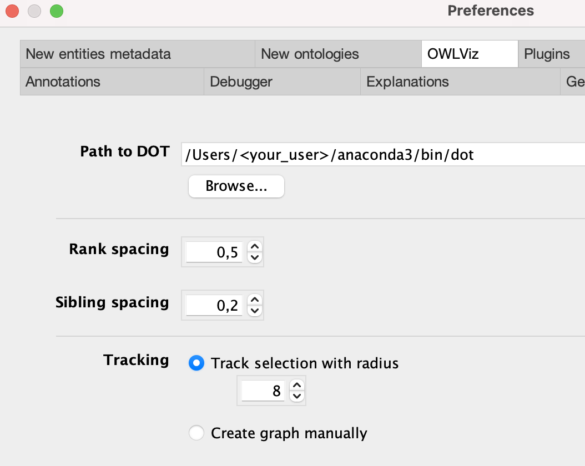
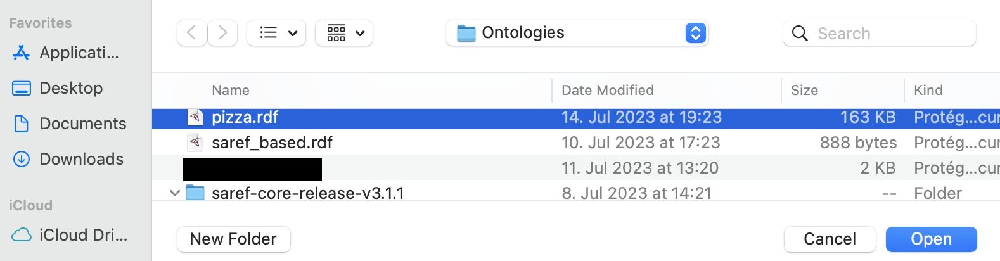

# Setup Instructions to Visualize the Ontology

## Protégé

### OWLViz

1. Download Protégé [here](https://protege.stanford.edu/) (If you run into installation problems on an older mac, [this](https://protegewiki.stanford.edu/wiki/Install_Protege5_Mac) could be helpful)

2. Make sure you have a ```dot``` instance available on your machine. On macOS you can check in your terminal with the command ```whereis dot```. It will show the available ```dot``` instances on your machine. If you do not have ```dot``` installed, you can install it via ```homebrew``` or via a python package manager like ```conda``` or ```pip```.

    Either of these options is fine:

    - ```brew install graphviz``` (requires homebrew)
    - ```conda install graphviz```
    - ```pip install graphviz```

    Dot will be installed alongside graphviz. 

3. After installing graphviz, run the ```whereis dot``` command again and copy the absolute path to ```dot```. 
   
   **Important**: The file is called ```dot``` and **not** ```dot.1``` or anything else.

4. Open the Protégé settings and open the tab *OWLViz*. 
   
   - Insert the path to your dot instance into *Path to DOT*
   - Increase track selection radius to 8

    

5. Lastly, if the OWLViz tab is not opened in Protégé by default, open in the menu bar *Window* -> *Tabs* -> *OWLViz*. There you can open every tab you need including OWLViz, Classes, and Object Properties.

    

### Plugins

#### Requirements

The following plugins need to be installed via the plugins manager:

- Ontology Debugger
- Pellet Reasoner Plug-in
- HermiT (should be available by default)
- OWLViz (should be available by default)

#### Installation

Open the plugin manager by navigating in the menu bar to *File* -> *Check for plugins*


Install plugins by checking the left checkbox in the plugin manager next to the desired plugin and click on *Install*.


The plugin has been installed.

### Open an Ontology

1. Download the ontology file to your local machine
1. In Protege, navigate in the menu bar to *File* -> *Open*

    

1. A file explorer window opens in which the user has to select the ontology file to be opened. After selecting the file, click *Open*.

    

1. The ontology file opens.

## WebVOWL

### Visualization

Another visualization possibility is [WebVOWL](http://vowl.visualdataweb.org/webvowl.html). Since it is an online tool, you do not need any setup work to do and can directly upload the ontology file in WebVOWL within the tab *Ontology*.


### Filtering

To adjust the level of detail displayed in WebVOWL, the *Filter* option is given. It provides the possibility to ignore certain parts of the ontology, like Data Properties, and to adjust the degree of collapsing. 

The whole ontology is shown when nothing is filtered and the degree of collapsing is set to 0.


